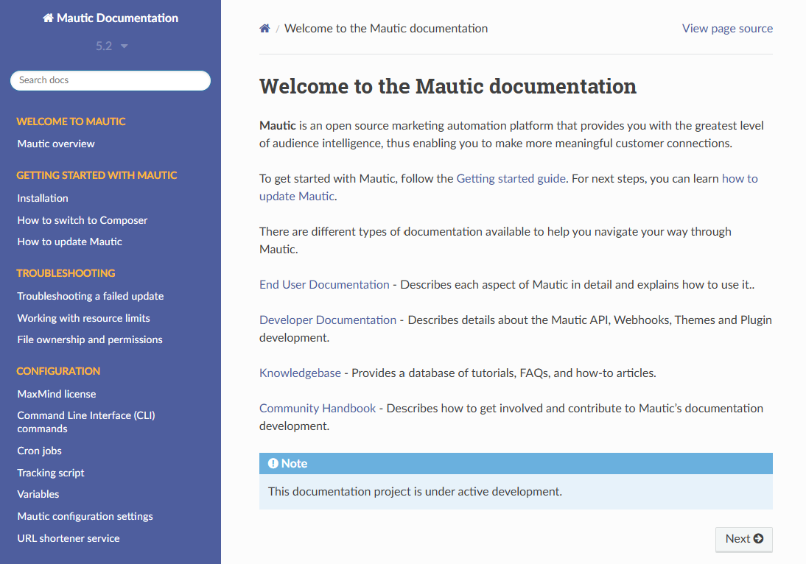

# Documentation Tooling Project (Docusaurus Site)

This project involved auditing and improving the getting started section for [Mautic documentation](https://docs.mautic.org/en/5.2/) using Docusaurus.

## Improved Pages
...

## What I Improved
- [Example improvement 1]
- [Example improvement 2]
- [Example improvement 3]

## Challenges
- [Challenge 1]
- [Challenge 2]

## What I Learnt
- [Key takeaway 1]
- [Key takeaway 2]
