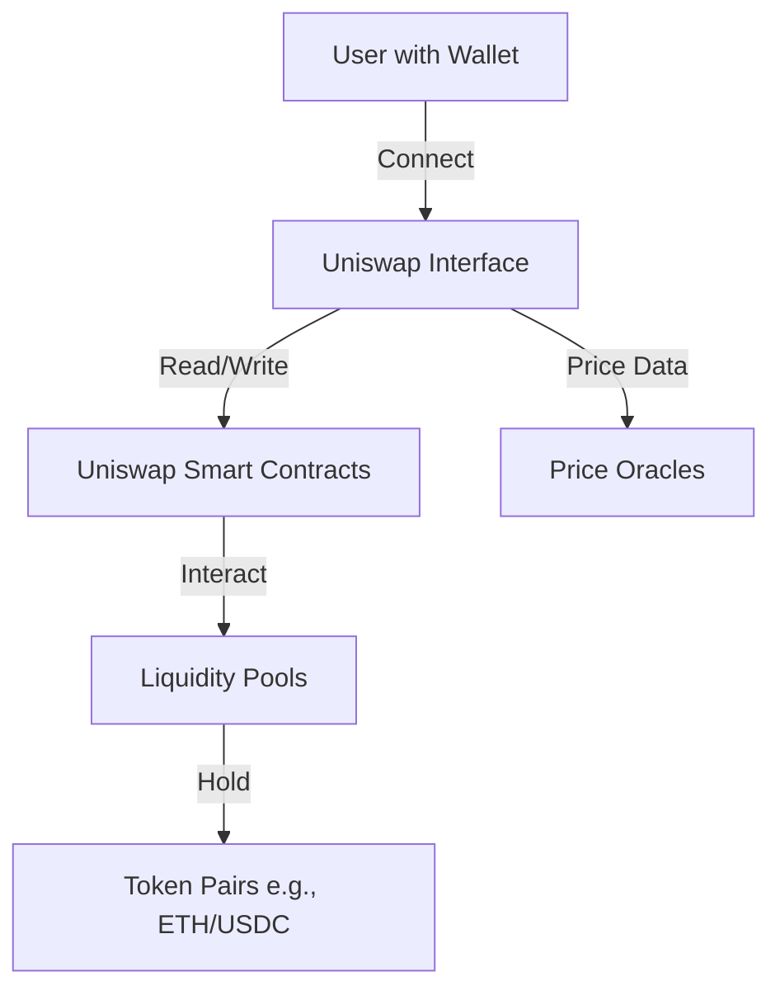

This page explains the key concepts behind Uniswap V3, a decentralized exchange (DEX) that lets you trade tokens (cryptocurrencies) directly on the blockchain without needing a traditional middleman.

## Overview

Uniswap V3 is like a digital marketplace where you can swap one cryptocurrency for another. Instead of buyers and sellers, it uses "liquidity pools" where people provide tokens to enable trading and earn fees.

### Key Benefits

- **Better Prices**: Concentrated liquidity means trades have less impact on price.
- **Earn Fees**: Provide liquidity and earn a share of trading fees.
- **Permissionless**: Anyone can add tokens or create new markets.
- **Secure**: Runs on Ethereum's blockchain with battle-tested smart contracts.

## Core Concepts

### 1. Liquidity Pools
A pool is like a shared pot of two tokens (e.g., ETH and USDC). People who add tokens to these pools are called "liquidity providers" (LPs).

### 2. Concentrated Liquidity
Unlike traditional AMMs, Uniswap V3 lets LPs choose specific price ranges to provide liquidity, making capital more efficient.

### 3. Swaps
When you trade one token for another, the protocol automatically finds the best price across all available pools.

### 4. Fees
- **TradingFees**: A small percentage (e.g., 0.3%) is charged on each trade and distributed to LPs.
- **GasFees**: Paid to the Ethereum network to process transactions.

## User Stories

### For Traders
- "I want to swap ETH for USDC with the lowest fees."
- "I need to know how much USDC I'll get for 1 ETH before I trade."

### For Liquidity Providers
- "I want to earn fees by providing liquidity to the ETH/USDC pool."
- "I'd like to provide liquidity only when the price is between $1,800 and $2,200 per ETH."

## Architecture Overview

### Key Components

1. **Swap Router**: Handles token swaps and finds the best trading routes.
2. **Factory**: Creates and manages liquidity pools.
3. **Quoter**: Provides price quotes for trades.
4. **Non-Fungible Position Manager**: Manages liquidity positions as NFTs.

## Economic Model

### Value Flow
- **Traders** pay fees for swapping tokens.
- **Liquidity Providers** earn fees by supplying tokens to pools.
- **Protocol**: Takes a small fee (if enabled by governance).

### Fee Tiers
Uniswap V3 offers multiple fee tiers to suit different trading pairs:
- 0.05%: For stablecoin pairs (e.g., USDC/USDT)
- 0.30%: For most common pairs (e.g., ETH/USDC)
- 1.00%: For exotic or less liquid pairs

## Next Steps
- Learn how to [make your first swap](/docs/web3/getting-started).
- Explore [providing liquidity](/docs/web3/example-interactions#adding-liquidity) to earn fees.
- Check the [smart contract reference](/docs/web3/smart-contract-reference) for technical details.
